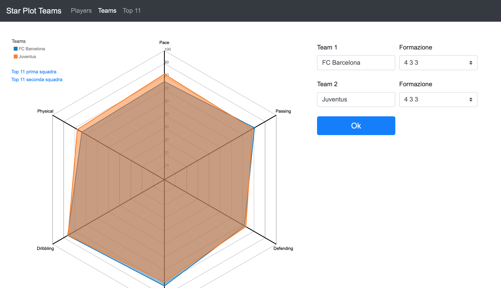

# Starplots Fifa 2019
Progetto per il corso di [Visualizzazione delle Informazioni](http://www.dia.uniroma3.it/~infovis/). Implementazione di una interfaccia grafica composta da 3 viste per comparare le statistiche [FIFA 2019](https://it.wikipedia.org/wiki/FIFA_19) di giocatori e squadre. Le tre viste realizzate sono:

- Starplot per confrontare due giocatori;
- Starplot per confrontare due squadre;
- Starplot che mostra il contributo individuale dei vari giocatori alla squadra.

Segue una breve descrizione delle tre viste.

## 1. Viste

#### Starplot per confrontare due giocatori

Con questa vista è possibile confrontare due giocatori sulla base di 6 skill differenti. 
(se i due giocatori in questione sono portieri, e.g. Buffon e Mirante, le skill che vengono mostrate nello starplot saranno specifiche per i portieri, e.g *Diving*, *Handling*).
Sotto la legenda è presente un link che punta alla vista che confronta le squadre dei due giocatori mostrati nella vista corrente.

#### Starplot per il confronto di due squadre

Con questa vista è possibile confrontare due squadre sulla base di 6 skill differenti.
Sotto la legenda sono presenti due link (uno per ciascuna squadra nella vista corrente), i quali rimandano alla vista che consente di vedere il contributo dei singoli giocatori alle statistiche complessive della squadra in cui giocano.

#### Starplot che mostra i contribuiti individuali dei giocatori alla squadra

In questa vista è possibile visualizzare come i singoli giocatori contribuiscono alle statistiche (skill) della squadra in cui giocano. Sempre in questa vista, selezionando due giocatori dalla legenda, verrà mostrato un link che punta alla vista che consente di poter confrontare i giocatori selezionati.

## 2. Barre di Ricerca

Nelle tre viste sono presenti delle barre di ricerca per inserire i giocatori (o i team) che si intendono confrontare. 
Qualora il nome digitato non fosse corretto, verranno mostrati dei suggerimenti all'utente.
Nelle viste Star Plot Teams e Star Plot Top 11 è presente una barra _dropdown_ per poter selezionare la formazione sulla base della quale computare e visualizzare le statistiche del team in questione.

## 3. Skills

Il confronto tra due giocatori o due squadre viene effettuato attraverso la comparazione di 6 skill. 
 
Le skill in questione per i giocatori (che non siano portieri) sono le seguenti: 
  <li> Pace </li>  
  <li> Passing </li>
  <li> Defending </li>
  <li> Shooting </li>
  <li> Dribbling </li>
  <li> Physical </li>

 
Si riportano di seguito le skill relative ai portieri: 
  <li> Diving </li>  
  <li> Handling </li>
  <li> Positioning </li>
  <li> Reflexes </li>
  <li> Reactions </li>
  <li> Kicking </li>

 

I valori di queste skill vengono calcolate secondo una serie di formule utilizzate in questo [sito](https://www.fifauteam.com/player-ratings-guide-fifa-19/)

Per quanto riguarda la terza vista, che come detto in precedenza mostra come i singoli giocatori incidono sulle caratteristiche complessive della squadra, sono state definite a priori delle percentuali che esprimono come ciascun giocatore, in base al ruolo, influisce sulle statistiche della squadra. 
 
Nello specifico, ciascun giocatore influisce con le sue abilità alle skill (_Pace_, _Shooting_, ecc.) della squadra in cui gioca secondo le seguenti percentuali:
  <li> Pace: Attaccante 60%, Centrocampista 20%, Difensore 20%, Portiere 0% </li>  
  <li> Passing: Attaccante 10%, Centrocampista 80%, Difensore 10%, Portiere 0% </li>
  <li> Defending: Attaccante 1%, Centrocampista 14%, Difensore 60%, Portiere 25% </li>
  <li> Shooting: Attaccante 75%, Centrocampista 20%, Difensore 5%, Portiere 0% </li>
  <li> Dribbling: Attaccante 70%, Centrocampista 20%, Difensore 10%, Portiere 0% </li>
  <li> Physical: Attaccante 20%, Centrocampista 20%, Difensore 60%, Portiere 0% </li>
  
## 4. Componenti del team
- [Jerin George Mathew](https://github.com/jgeorgemathew)
- [Luca Pasquini](https://github.com/lucapas)

## 5. Live demo
È disponibile una live demo al seguente [link](https://lucapas.github.io/Infovis/StarPlotPlayers.html)
